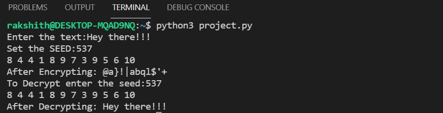

# 🔒 Encrption and Decryption using MQTT
### About the project:
■ Encryption is the process through which data is encoded so that it remains hidden from or inaccessible to unauthorized users and Decryption is a process of converting encoded/encrypted data in a form that is readable and understood by a human or a computer.
<br>

■ This Encryption and Decryption is carried out through MQTT server in this project.
<br>

■ MQTT is a publish-and-subscribe protocol, meaning that instead of communicating with a server, client devices and applications publish and subscribe to topics handled by a broker.

## Code for Encryption and Decryption using Python:
   
   ### In the file project.py:
   ``` python
   
from random import randint, seed

message= input("Enter the text:")
variable = ""
variable1 = ""
#FOR ENCRYPTION:
s=int(input("Set the SEED:"))
seed(s)
for i in message:
    key= randint(1,10)
    print(key,end=" ")
    asc_val= ord(i)
    xor_= asc_val ^ key
    encrypted =chr(xor_)
    variable += encrypted
print()
print("After Encrypting:",variable, end="")
print()

#FOR DECRYPTION:
n= int(input("To Decrypt enter the seed:"))
seed(n)
for i in variable:
    key= randint(1,10)
    print(key,end=" ")
    asc = ord(i)
    xor = asc ^ key
    decrypt= chr(xor)
    variable1 += decrypt
print()
print("After Decrypting:",variable1, end="")
print()

```

 ■ This code encrypts and decrypts the text or message entered by user:
 
   ◉ After executing this code using LINUX command, it ask's the user to enter the messege which must be encrypted.
   <br>
   ◉ It say's to set the [SEED](https://www.geeksforgeeks.org/random-seed-in-python/#:~:text=Seed%20function%20is%20used%20to,number%20generated%20by%20the%20generator). This seed is used to generate different keys for encryption. It is shown in below pic: 
   <br>
   
   
   <p align= "center">
   </p>
  
   ◉ After entering the message and seed, the code generates the different keys for each characters in the message. The ascii value of each character is found and exored with each key that provides the encrypted form of message.
  <br>
   
  
  <p align= "center">
  </p>
  
   ◉ To decrypt the encrypted message, it asks for the SEED that has been set for encrypt the message. Now it proceeds in reverse process, it finds the ascii value of each character of encrypted message and the SEED provides the same keys and exored, finally gets the plain text entered by the user.
   <br>
   
   
   <p align= "center">
   </p>
   
 The above procedure is to show how Encryption and Decryption works.
 
 ⇒ NOTE: SEED plays important role here, it must be shared between sender and receiver. As long as SEED is safe the message is also secured.
 <br>
 
 ### Encryption and Decryption Using MQTT server:
 
   ■ To set-up MQTT, the publisher and subscriber plays important roles.The set-up as follows:
      
   ◉ Here the publisher is set-up with Paho-mqtt and created a hostname and topic. Where the subscriber is connected with these name and topic.
      
   ### In the file Encryption.py
   ``` python
   
from random import randint, seed

import paho.mqtt.client as paho
import sys

message= input("Enter the text:")
variable = ""
hexa_= ""

S = int(input("Set the seed:"))
seed(S)
for i in message:
    key= randint(1,10)
    asc_val= ord(i)
    xor_= asc_val ^ key
    encrypted =chr(xor_)
    variable += encrypted
for i in variable:
     hexa = hex(ord(i))
     hexa_ += hexa[2:].zfill(2)
print("After encrypting:",hexa_) 

client = paho.Client()

if client.connect("localhost", 1883, 60) != 0:
    print("cloud not connect to MQTT broker")
    sys.exit(-1)

client.publish("encrypt",hexa_, 0)

client.disconnect()

```
◉ The above code acts as a publishing message in encrypted form.

⇒NOTE: Here the encrypted message is in the form of Hexadecimals, beacause after exoring there are some non printable character which are not displayed so for subscriber while copying the message it not recognizes these character. Hence it is converted into hexadecimals.

◉ The subscriber is connected to the Encryption.py code of publisher's as shown below:
   Here im using 2 terminals, one is for publisher to send message and another is subscriber connected to publisher.
   <br>
    

<p align= "center">
</p>
   
   
   
        
